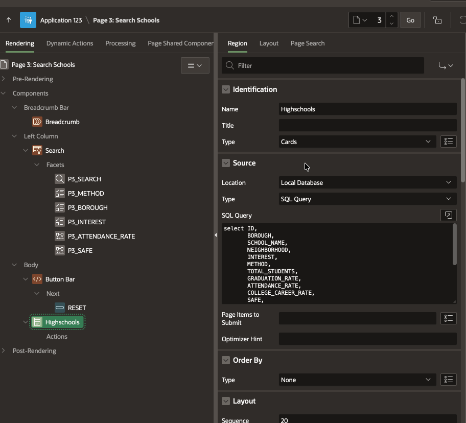

# APEX Email Classic Report 📧

A dynamic action plugin that allows the user to have similar functionality as IR/IG Action to Send report view as an attachment.

Simple setup and support Substituion Strings for properties

## 📋 Requirements

* **Developed and Tested on Oracle APEX 24.2** or later.

## 📦 Installation

1.  Download the latest `dynamic_action_plugin_synora_email_classic_report.sql`.
2.  Log in to your Oracle APEX Workspace.
3.  Go to **App Builder > Your Application > Shared Components > Plug-ins**.
4.  Click **Import** and select the `.sql` file.
5.  Follow the wizard steps to complete the installation.

## ⚙️ Usage

1.  Select the Report Region and set the **Static ID:**to a unique value for the page
2.  Add a **Button** to your page.
3.  Create a new **Dynamic Action**.
    * **Name:** `Email Report Region as Attachment`
    * **Event:** `On Click`
4.  In the **True** action:
    * **Action:** `Email Classic Report` (Plugin).
5.  Configure the Plugin properties:
    ### Settings
    * **Format:** `Select the output format for the attachment``
    * **Filename:** `Provide a name for the file without an extension``
    ### Report
    * **Region Static ID:** `region-static-id``
    ### Email Settings
    Set the required and optional properties
    * Required => **From:** `&APP_EMAIL.` or to any allowed sender value
    * Required => **To:** `Recipient Email Address` or Substituion String
    * Optional => **CC:** `Recipient Email Address` or Substituion String
    * Optional => **BCC:** `Recipient Email Address` or Substituion String
    * Optional => **Reply To:** `Recipient Email Address` or Substituion String
    * Required => **Body Plain Text:** `Email Body` or Substituion String
    * Optional => **Body HTML:** `Email Body as HTML`

Suggest: Add Page region to allow the user to provide the plugin properties

## 🤝 Contributing

Issues and Pull Requests are welcome. This project is intended to be a safe, welcoming space for collaboration.

## 📄 License

[MIT](LICENSE)